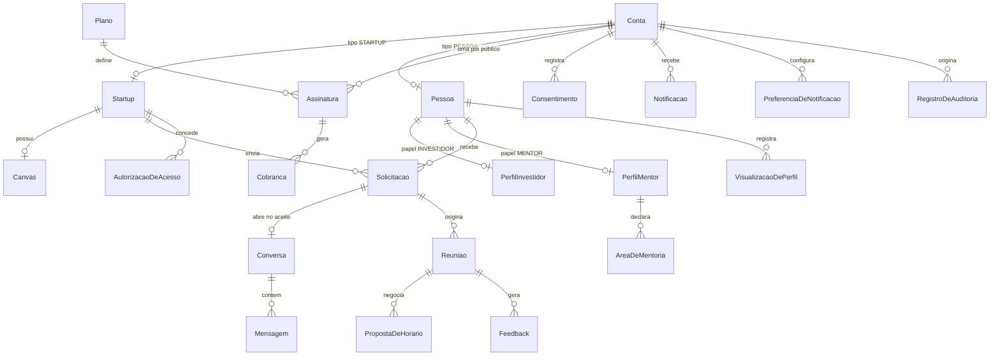

# Modelagem de dados

Modelo do `prisma/schema.prisma`. Cada entidade aponta o requisito que a origina e o ADR que a decide.

> **Estado:** decidida. Todas as entidades entram na primeira migration. Os pontos que restam **em
> aberto** são valores de negócio que não mudam a estrutura do schema — ver a última seção.

## Convenções

- Identificador primário `String` com `@default(uuid(7))`. UUID v7 é ordenável por tempo, o que evita
  a fragmentação de índice do UUID v4 sem expor contagem de registros como um inteiro sequencial
  faria.
- `criadoEm` e `atualizadoEm` em toda entidade que não seja log.
- Nomes de model no singular, em português sem acento: `Startup`, `Solicitacao`, `Assinatura`.
- Enum em `SCREAMING_SNAKE_CASE`, refletindo as listas fechadas do documento.
- **Nada de exclusão física** em entidade que participe de interação. O RF14 exige anonimização.
- **Valor monetário em centavos, como `Int`** ([ADR 0027](./adr/0027-valor-monetario-em-centavos-exibido-como-faixa.md)).
- **Regra de tamanho de lista e de valor mínimo vive no DTO**, não no banco. O banco garante
  unicidade e integridade referencial.
- **Restrição que o Prisma não expressa** — índice único parcial — é escrita no SQL da migration e
  coberta por teste de integração, porque regerar a migration do zero a apagaria em silêncio.

## Visão geral

## Identidade e acesso

### `Conta` — RF07

A unidade de autenticação. **Tipo de conta e papel são conceitos distintos**
([ADR 0010](./adr/0010-tipo-de-conta-e-papeis-acumulaveis.md)): o tipo é exclusivo e define a
natureza do cadastro; o papel só existe dentro de `PESSOA` e é acumulável.

| Campo               | Observação                                                               |
| ------------------- | ------------------------------------------------------------------------ |
| `email`             | Único                                                                    |
| `senhaHash`         | bcrypt ou argon2. **Nunca criptografia reversível** (RNF02)              |
| `tipo`              | `TipoDeConta`                                                            |
| `status`            | `StatusDaConta`                                                          |
| `emailVerificadoEm` | Verificação obrigatória antes do primeiro login                          |
| `mfaSegredo`        | TOTP. Opcional para startup e pessoa, **obrigatório** para administrador |
| `mfaAtivadoEm`      | Nulo enquanto o segundo fator não estiver ativo                          |
| `anonimizadaEm`     | Marca a exclusão do RF14                                                 |

**`StatusDaConta` tem três valores: `ATIVA`, `INATIVA`, `SUSPENSA`.** O RF07 diz que
"conta inativada, suspensa ou reprovada não autentica". Reprovação **não** vira status da conta: ela
já vive em `statusDeModeracao`, e duplicá-la permitiria os dois campos divergirem. E-mail não
verificado também não vira status, porque `emailVerificadoEm` já registra isso.

A conta de administrador é criada apenas por outro administrador, nunca por cadastro público.

**Não existe tabela de sessão.** A sessão é opaca e vive no Redis (RF07) — ver
[ADR 0002](./adr/0002-sessao-opaca-em-redis.md).

### `CodigoDeRecuperacaoMfa` — RF07

Códigos de uso único, armazenados com hash. Campo `usadoEm` em vez de remoção, para a auditoria
registrar que um código foi consumido.

### `Pessoa`, `PerfilInvestidor`, `PerfilMentor` — RF02

`Pessoa` guarda o bloco comum (nome, cidade, LinkedIn, empresa/atuação) e os campos de moderação.
Cada papel é uma tabela própria em relação 1-para-1 opcional.

Modelar papel como tabela separada, e não como campo booleano em `Pessoa`, é o que dá sentido
verificável ao critério "papel incompleto não participa do matchmaking": o papel existe quando a
linha existe e está completa, não quando alguém marcou uma caixa.

- **`PerfilInvestidor`:** tese, segmentos de interesse, estágios de interesse, faixa de ticket
  (`ticketMinimo` e `ticketMaximo` em centavos), modelo de negócio preferido.
  - Segmentos: **no mínimo 1, sem máximo**.
  - Estágios: **no mínimo 1**.
  - Com zero em qualquer um dos dois, o critério correspondente do score nunca pontua e o investidor
    ficaria "completo" sem tese. Os mínimos são validados no DTO.
- **`PerfilMentor`:** disponibilidade em horas por mês, e a contagem de avaliações recebidas — é ela
  que decide se o cartão mostra os anos declarados ou a nota
  ([ADR 0024](./adr/0024-nota-do-mentor-e-publica.md)).
- **`AreaDeMentoria`:** tabela própria, uma linha por área do mentor, com a área e os **anos de
  experiência**. Única por mentor e área.

## Startup e vitrine

### `Startup` — RF01, RF16

Obrigatórios: nome, **segmentos** (um ou dois, nunca mais), estágio, cidade, descrição curta, faixa
de capital buscado (`capitalMinimo` e `capitalMaximo` em centavos, teto obrigatório, mínimo R$ 1.000),
natureza da busca. Opcionais: CNPJ (startup em ideação frequentemente não tem), site, logotipo.

O limite de dois segmentos é regra de negócio, não de banco: o PostgreSQL aceita lista de enum, e a
validação do tamanho vive no DTO.

**`vinculoPortoDigital` é texto livre opcional.** A startup descreve o vínculo (programa, residência,
contrato) e o moderador confere. Um booleano não daria ao moderador nada para conferir contra o
critério de "vínculo comprovável" do [ADR 0025](./adr/0025-criterios-de-moderacao-por-tipo-de-conta.md).

Criada com `statusDeModeracao = PENDENTE` e **não aparece em matchmaking nem em busca** até ser
aprovada (RF08, RF16).

### Moderação em `Startup` e em `Pessoa` — RF08, RF16

`statusDeModeracao`, `motivoDaModeracao`, `moderadaEm` e `verificadaEm` ficam **nas duas tabelas**,
não na `Conta`. O [ADR 0025](./adr/0025-criterios-de-moderacao-por-tipo-de-conta.md) define critérios
diferentes por tipo de conta, e o administrador não passa por moderação — guardar na `Conta` criaria
um campo sem sentido para ele. O motivo é gravado porque o RF08 manda notificar resultado e motivo.

### `Canvas` — RF06

Relação 1-para-1 com `Startup`. Um campo por bloco: problema, solução, proposta de valor, tamanho de
mercado, tração, modelo de receita.

Blocos como colunas nomeadas, e não como JSON genérico, porque a comparabilidade entre startups é o
ponto do requisito — e porque `canvasCompleto` precisa ser verificável para a startup se tornar
elegível ao matchmaking.

## Conexão

### `Solicitacao` — RF05

Estados: `PENDENTE` → `ACEITA` | `RECUSADA` | `EXPIRADA`. Campo `pauta` **obrigatório**.

Decisões ([ADR 0004](./adr/0004-cota-com-devolucao.md), [ADR 0030](./adr/0030-solicitacao-a-investidor-e-mentor.md)):

- A startup envia a **investidor ou mentor**. A linha grava o `papelDoDestinatario`, porque a mesma
  pessoa pode ter os dois papéis.
- As duas consomem cota. A cota é debitada no envio e devolvida nas transições para `RECUSADA` e
  `EXPIRADA`.
- **A cota é por mês calendário**, contada por `enviadaEm`. Não existe tabela de saldo.
- **No máximo uma `PENDENTE` por startup, pessoa e papel** — índice único parcial.
- Expira em 15 dias sem resposta, por rotina do dispatcher. `expiraEm` é gravado, não calculado: a
  rotina precisa de índice para varrer, e o prazo de uma solicitação já criada não pode mudar se a
  regra mudar depois.

### `Conversa` e `Mensagem` — RF05

`Conversa` em 1-para-1 com `Solicitacao`, criada **apenas após o aceite**. Nunca antes.

### `Reuniao` e `PropostaDeHorario` — RF05

Decisões em [ADR 0032](./adr/0032-estados-da-reuniao-e-contraproposta.md):

- Estados: `PROPOSTA`, `CONFIRMADA`, `RECUSADA`, `REALIZADA`, `NAO_REALIZADA`.
- **Contraproposta não é estado.** Cada proposta de horário é uma linha em `PropostaDeHorario` com
  autor e data/hora. O horário vigente é o da proposta mais recente.
- **Várias reuniões por solicitação, no máximo uma ativa** (`PROPOSTA` ou `CONFIRMADA`) — índice
  único parcial.
- Pauta obrigatória. Integração com calendário externo está fora de escopo.

### `Feedback` — RF10

Decisões em [ADR 0033](./adr/0033-escala-e-criterios-do-feedback.md):

- Liberado só para reunião `REALIZADA`. Um feedback por reunião e avaliador.
- **Nota de 1 a 5 por critério.** Texto livre opcional. A nota geral é derivada, não gravada.

| Quem avalia          | Critérios                                      |
| -------------------- | ---------------------------------------------- |
| Startup → pessoa     | Qualidade da conversa, utilidade da orientação |
| Investidor → startup | Preparação da startup, aderência à tese        |
| Mentor → startup     | Preparação da startup, abertura à orientação   |

Critério como coluna nula quando não se aplica ao par avaliador–avaliado. A combinação válida de
colunas por par é validada no DTO.

**A visibilidade é modelada, não filtrada na aplicação.** Um campo `visibilidade` na linha evita que
a regra dependa de alguém lembrar de aplicar o filtro certo em cada consulta.

| Quem recebeu a avaliação | `visibilidade`          | Quem vê                                                                                        |
| ------------------------ | ----------------------- | ---------------------------------------------------------------------------------------------- |
| Startup                  | `PUBLICA`               | Qualquer usuário aprovado, no perfil dela                                                      |
| Mentor                   | `STARTUP_APOS_TERCEIRA` | A startup, a partir da terceira avaliação ([ADR 0024](./adr/0024-nota-do-mentor-e-publica.md)) |
| Investidor               | `SOMENTE_ADMINISTRADOR` | **Apenas o administrador** ([ADR 0012](./adr/0012-visibilidade-assimetrica-do-feedback.md))    |

## Matchmaking

O score do RF03 é **determinístico e calculado sob demanda** — ver
[ADR 0003](./adr/0003-score-deterministico.md). Não existe tabela de match materializada: o score é
função dos perfis, e perfil muda.

### Visibilidade dos dois lados — acréscimo ao documento

O RF04 define o perfil público **apenas da startup** e silencia sobre o investidor. Decisão tomada:
**o perfil do investidor também é visível às startups** — tese, segmentos e estágios de interesse,
faixa de ticket e modelo preferido.

Sem isso a descoberta funcionaria em um sentido só, e o RF15 (busca e filtro manual) não teria o que
a startup buscar.

Não conflita com o [ADR 0012](./adr/0012-visibilidade-assimetrica-do-feedback.md): o que continua
restrito ao administrador é a **nota** do investidor, não o perfil dele.

### `VisualizacaoDePerfil` — RF09

Registra que uma pessoa viu o cartão de uma startup, com o papel com que viu. É o insumo da métrica
"quantos investidores visualizaram seu perfil", que é um dos diferenciais entre plano gratuito e pago.

### `AutorizacaoDeAcesso` — RF13

Formaliza o acesso ao perfil completo. Decisões em
[ADR 0031](./adr/0031-mentor-pode-pedir-acesso-ao-perfil-completo.md):

- **Investidor e mentor podem pedir.** A linha grava o `papelDoSolicitante`.
- Estados: `PENDENTE`, `APROVADA`, `NEGADA`. Revogação por `revogadaEm`, não por estado nem exclusão —
  negativa e revogação precisam ficar registradas.
- **No máximo uma `PENDENTE` por startup, pessoa e papel** — índice único parcial. Negativa não
  bloqueia novo pedido.
- Revogação surte efeito na requisição seguinte.

## Assinatura e pagamento

Decisões em [ADR 0028](./adr/0028-plano-por-publico-em-tres-niveis.md) e
[ADR 0029](./adr/0029-destaque-pago-do-mentor-na-busca.md).

### `Plano` — RF17

Identificado por **público e nível**, únicos em par:

- `PublicoDoPlano`: `STARTUP`, `INVESTIDOR`, `MENTOR`.
- `NivelDoPlano`: `GRATUITO`, `PRO`, `PREMIUM`.

São nove planos. **O gratuito é uma linha**, não a ausência de plano. A tabela nasce **sem seed**:
preços e limites estão em aberto.

Um limite por coluna. **Limite numérico nulo significa sem limite**; coluna que não se aplica ao
público do plano é ignorada.

| Coluna                     | Público    | Tipo     |
| -------------------------- | ---------- | -------- |
| `precoEmCentavos`          | Todos      | Int      |
| `cotaMensalDeSolicitacoes` | Startup    | Int nulo |
| `limiteDeMatchesVisiveis`  | Investidor | Int nulo |
| `limiteMensalDeAceites`    | Mentor     | Int nulo |
| `feedbackDetalhado`        | Mentor     | Boolean  |
| `destaqueNaBusca`          | Mentor     | Boolean  |
| `buscaAvancada`            | Todos      | Boolean  |
| `metricasDeVisualizacao`   | Todos      | Boolean  |
| `exportacaoDeRelatorios`   | Todos      | Boolean  |

### `Assinatura` — RF17

Estados: `SEM_PLANO`, `ATIVA`, `CANCELADA_VIGENTE`, `INADIMPLENTE_EM_TOLERANCIA`, `ENCERRADA`. A
tabela de transições do RF17 é a referência — **nenhuma transição fora dela é válida**.

**Única por conta e público.** Pessoa com os dois papéis pode ter duas assinaturas independentes. Que
o plano seja do mesmo público da assinatura é regra do caso de uso — o banco não expressa restrição
entre colunas de tabelas diferentes.

### `Cobranca` — RF17

Uma linha por cobrança da assinatura, para o histórico de cobranças do RF17. Estados: `PENDENTE`,
`PAGA`, `FALHOU`, `ESTORNADA`. Valor em centavos e ID da cobrança no gateway, único.

### `EventoDeWebhook` — RF17

Todo webhook recebido é registrado com payload, resultado do processamento e data. Restrição de
unicidade no ID do evento do gateway — é a primeira das três defesas de idempotência da seção 8.4.

### `TrabalhoPendente` (outbox) — seção 8.4

Gravado na **mesma transação** do evento de pagamento, com `enfileiradoEm` nulo. O dispatcher varre,
reserva com `FOR UPDATE ... SKIP LOCKED` e enfileira no BullMQ. Ver
[ADR 0006](./adr/0006-outbox-no-pagamento.md).

Índice em `enfileiradoEm` — a varredura é a operação mais frequente sobre esta tabela.

## Governança

### `Consentimento` — RF11

Consentimento **granular**, não checkbox único: termos de uso e tratamento de dados são
obrigatórios; comunicações de marketing é opcional e não bloqueia o cadastro.

Cada registro guarda data, hora, IP e **versão do documento aceito**. Alteração dos termos gera nova
versão e o histórico anterior é preservado — por isso é uma linha por aceite, nunca um campo
booleano atualizado.

**`revogadoEm`** registra a revogação. A LGPD garante ao titular revogar consentimento, e o de
marketing é justamente o que ele pode retirar sem sair da plataforma.

### `RegistroDeAuditoria` — RNF10

Quem, o quê, quando e de onde (IP). **Somente escrita** — nem o administrador edita ou remove.
Retenção de 12 meses. Sem `atualizadoEm`, por ser log.

Registra: ações de moderação, concessão e revogação de acesso a dado protegido, alterações de
assinatura e eventos de pagamento, alterações de papel, tentativas de login malsucedidas, e os
próprios acessos à tela de auditoria. O ator é nulo na tentativa de login com e-mail inexistente.

### `Notificacao` e `PreferenciaDeNotificacao` — RF12

Notificação in-app com histórico. `PreferenciaDeNotificacao` guarda, por conta e tipo, se o usuário
recebe por e-mail.

`TipoDeNotificacao` segue os eventos do RF12, mais três de segurança
([ADR 0034](./adr/0034-notificacoes-de-seguranca.md)). Os de moderação, segurança e assinatura
**não são desativáveis**.

## Enums

| Enum                     | Valores                                                                                                                                                                                                                                                                                                                                                                            | Origem                |
| ------------------------ | ---------------------------------------------------------------------------------------------------------------------------------------------------------------------------------------------------------------------------------------------------------------------------------------------------------------------------------------------------------------------------------- | --------------------- |
| `TipoDeConta`            | `STARTUP`, `PESSOA`, `ADMINISTRADOR`                                                                                                                                                                                                                                                                                                                                               | Seção 3.1             |
| `StatusDaConta`          | `ATIVA`, `INATIVA`, `SUSPENSA`                                                                                                                                                                                                                                                                                                                                                     | RF07                  |
| `Papel`                  | `INVESTIDOR`, `MENTOR`                                                                                                                                                                                                                                                                                                                                                             | Seção 3.1             |
| `Segmento`               | `FINTECH`, `HEALTHTECH`, `EDTECH`, `AGROTECH`, `HRTECH`, `LEGALTECH`, `MARTECH`, `LOGTECH`, `GOVTECH`, `CONSTRUTECH`, `ECONOMIA_CRIATIVA`, `RETAILTECH`                                                                                                                                                                                                                            | RF01, ADR 0026        |
| `AreaDeExpertise`        | `PRODUTO`, `TECNOLOGIA`, `DESIGN_E_UX`, `MARKETING`, `FINANCAS`, `VENDAS_E_GO_TO_MARKET`, `PESSOAS_E_CULTURA`, `JURIDICO_E_SOCIETARIO`, `CAPTACAO_E_INVESTIMENTO`                                                                                                                                                                                                                  | RF02, ADR 0024        |
| `EstagioDaStartup`       | `IDEACAO`, `VALIDACAO`, `TRACAO`, `ESCALA`                                                                                                                                                                                                                                                                                                                                         | RF01                  |
| `NaturezaDaBusca`        | `CAPITAL`, `MENTORIA`, `AMBOS`                                                                                                                                                                                                                                                                                                                                                     | RF01                  |
| `ModeloDeNegocio`        | `B2B`, `B2C`, `AMBOS`                                                                                                                                                                                                                                                                                                                                                              | RF02                  |
| `StatusDeModeracao`      | `PENDENTE`, `APROVADO`, `REPROVADO`                                                                                                                                                                                                                                                                                                                                                | RF01, RF08            |
| `StatusDaSolicitacao`    | `PENDENTE`, `ACEITA`, `RECUSADA`, `EXPIRADA`                                                                                                                                                                                                                                                                                                                                       | RF05                  |
| `StatusDaReuniao`        | `PROPOSTA`, `CONFIRMADA`, `RECUSADA`, `REALIZADA`, `NAO_REALIZADA`                                                                                                                                                                                                                                                                                                                 | RF05, ADR 0032        |
| `VisibilidadeDoFeedback` | `PUBLICA`, `STARTUP_APOS_TERCEIRA`, `SOMENTE_ADMINISTRADOR`                                                                                                                                                                                                                                                                                                                        | RF10, ADR 0012 e 0024 |
| `StatusDaAutorizacao`    | `PENDENTE`, `APROVADA`, `NEGADA`                                                                                                                                                                                                                                                                                                                                                   | RF13, ADR 0031        |
| `PublicoDoPlano`         | `STARTUP`, `INVESTIDOR`, `MENTOR`                                                                                                                                                                                                                                                                                                                                                  | RF17, ADR 0028        |
| `NivelDoPlano`           | `GRATUITO`, `PRO`, `PREMIUM`                                                                                                                                                                                                                                                                                                                                                       | RF17, ADR 0028        |
| `StatusDaAssinatura`     | `SEM_PLANO`, `ATIVA`, `CANCELADA_VIGENTE`, `INADIMPLENTE_EM_TOLERANCIA`, `ENCERRADA`                                                                                                                                                                                                                                                                                               | RF17                  |
| `StatusDaCobranca`       | `PENDENTE`, `PAGA`, `FALHOU`, `ESTORNADA`                                                                                                                                                                                                                                                                                                                                          | RF17, ADR 0028        |
| `TipoDeConsentimento`    | `TERMOS_DE_USO`, `TRATAMENTO_DE_DADOS`, `COMUNICACOES_DE_MARKETING`                                                                                                                                                                                                                                                                                                                | RF11                  |
| `TipoDeNotificacao`      | `SOLICITACAO_RECEBIDA`, `SOLICITACAO_ACEITA`, `SOLICITACAO_RECUSADA`, `SOLICITACAO_PRESTES_A_EXPIRAR`, `MENSAGEM_RECEBIDA`, `REUNIAO_PROPOSTA`, `REUNIAO_CONFIRMADA`, `REUNIAO_RECUSADA`, `CADASTRO_APROVADO`, `CADASTRO_REPROVADO`, `COBRANCA_APROVADA`, `COBRANCA_FALHOU`, `ASSINATURA_PRESTES_A_VENCER`, `ASSINATURA_REBAIXADA`, `LOGIN_NOVO`, `SENHA_ALTERADA`, `MFA_ALTERADO` | RF12, ADR 0034        |

## Em aberto

Nenhum destes muda a estrutura do schema. Todos impedem implementar a regra correspondente.

| O que falta                                                                     | Requisito | Onde está registrado |
| ------------------------------------------------------------------------------- | --------- | -------------------- |
| Pesos do score e valor do limiar                                                | RF03      | ADR 0003, 0026       |
| Preços e limites dos nove planos, incluindo o que diferencia `PRO` de `PREMIUM` | RF17      | ADR 0028             |
| Comportamento quando o mentor atinge `limiteMensalDeAceites`                    | RF17      | ADR 0028             |
| Como o destaque combina com a ordenação por score na busca                      | RF15      | ADR 0029             |
| Prazo da janela de tolerância por inadimplência                                 | RF17      | Seção 11             |
| Se o cancelamento é permitido durante inadimplência                             | RF17      | Seção 11             |
| Quem marca a reunião como realizada e o que acontece se as partes discordarem   | RF05      | ADR 0032             |
| O que dispara `LOGIN_NOVO` e `MFA_ALTERADO`                                     | RF12      | ADR 0034             |
| O que acontece com a assinatura quando a pessoa perde o papel                   | RF17      | ADR 0028             |
| Validação da escala do feedback na rodada beta                                  | RF10      | ADR 0033             |
