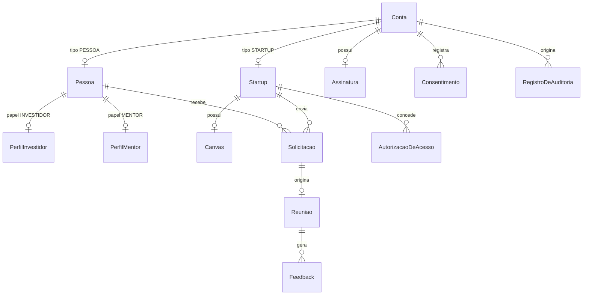

# Modelagem de dados

Modelo do `prisma/schema.prisma`. Cada entidade aponta o requisito que a origina.

> **Estado:** proposta. Nenhum model foi escrito no schema ainda. Os pontos marcados como
> **em aberto** são valores de negócio que o [`Projeto_Matchmaking.md`](../Projeto_Matchmaking.md)
> não define — eles precisam de decisão do grupo antes da primeira migration, não de escolha de quem
> implementa.

## Convenções

- Identificador primário `String` com `@default(uuid(7))`. UUID v7 é ordenável por tempo, o que evita
  a fragmentação de índice do UUID v4 sem expor contagem de registros como um inteiro sequencial
  faria.
- `criadoEm` e `atualizadoEm` em toda entidade que não seja log.
- Nomes de model no singular, em português sem acento: `Startup`, `Solicitacao`, `Assinatura`.
- Enum em `SCREAMING_SNAKE_CASE`, refletindo as listas fechadas do documento.
- **Nada de exclusão física** em entidade que participe de interação. O RF14 exige anonimização.

## Visão geral

## Identidade e acesso

### `Conta` — RF07

A unidade de autenticação. **Tipo de conta e papel são conceitos distintos** (seção 3.1): o tipo é
exclusivo e define a natureza do cadastro; o papel só existe dentro de `PESSOA` e é acumulável.

| Campo               | Observação                                                               |
| ------------------- | ------------------------------------------------------------------------ |
| `email`             | Único                                                                    |
| `senhaHash`         | bcrypt ou argon2. **Nunca criptografia reversível** (RNF02)              |
| `tipo`              | `TipoDeConta`                                                            |
| `status`            | `StatusDaConta`                                                          |
| `emailVerificadoEm` | Verificação obrigatória antes do primeiro login                          |
| `mfaSegredo`        | TOTP. Opcional para startup e pessoa, **obrigatório** para administrador |
| `mfaAtivadoEm`      | Nulo enquanto o segundo fator não estiver ativo                          |
| `anonimizadaEm`     | Marca a exclusão do RF14                                                 |

A conta de administrador é criada apenas por outro administrador, nunca por cadastro público.

**Não existe tabela de sessão.** A sessão é opaca e vive no Redis (RF07) — ver
[ADR 0002](./adr/0002-sessao-opaca-em-redis.md).

### `CodigoDeRecuperacaoMfa` — RF07

Códigos de uso único, armazenados com hash. Campo `usadoEm` em vez de remoção, para a auditoria
registrar que um código foi consumido.

### `Pessoa`, `PerfilInvestidor`, `PerfilMentor` — RF02

`Pessoa` guarda o bloco comum (nome, cidade, LinkedIn, empresa/atuação). Cada papel é uma tabela
própria em relação 1-para-1 opcional.

Modelar papel como tabela separada, e não como campo booleano em `Pessoa`, é o que dá sentido
verificável ao critério "papel incompleto não participa do matchmaking": o papel existe quando a
linha existe e está completa, não quando alguém marcou uma caixa.

- `PerfilInvestidor`: segmentos de interesse, estágios de interesse, faixa de ticket, modelo de
  negócio preferido.
- `PerfilMentor`: áreas de expertise, disponibilidade em horas por mês.

## Startup e vitrine

### `Startup` — RF01, RF16

Obrigatórios: nome, segmento, estágio, cidade, descrição curta, faixa de capital buscado, natureza
da busca. Opcionais: CNPJ (startup em ideação frequentemente não tem), site, logotipo.

Campos de moderação e verificação: `statusDeModeracao`, `verificadaEm`, `vinculoPortoDigital`.

Criada com `statusDeModeracao = PENDENTE` e **não aparece em matchmaking nem em busca** até ser
aprovada (RF08, RF16).

### `Canvas` — RF06

Relação 1-para-1 com `Startup`. Um campo por bloco: problema, solução, proposta de valor, tamanho de
mercado, tração, modelo de receita.

Blocos como colunas nomeadas, e não como JSON genérico, porque a comparabilidade entre startups é o
ponto do requisito — e porque `canvasCompleto` precisa ser verificável para a startup se tornar
elegível ao matchmaking.

## Conexão

### `Solicitacao` — RF05

Estados: `PENDENTE` → `ACEITA` | `RECUSADA` | `EXPIRADA`. Campo `pauta` **obrigatório** — nenhuma
solicitação é criada sem ele.

A cota é debitada no envio e devolvida nas transições para `RECUSADA` e `EXPIRADA`. Expira em 15
dias sem resposta, por rotina do dispatcher. Ver
[ADR 0004](./adr/0004-cota-com-devolucao.md).

`expiraEm` é campo gravado, não calculado na leitura: a rotina de expiração precisa de um índice
para varrer, e o prazo de uma solicitação já criada não pode mudar se a regra mudar depois.

### `Conversa` e `Mensagem` — RF05

Criadas **apenas após o aceite** da solicitação. Nunca antes.

### `Reuniao` — RF05

Data, hora, pauta e desfecho. Estados cobrindo proposta, aceite, recusa, contraproposta e realização.
Integração com calendário externo está fora de escopo.

### `Feedback` — RF10

Nota e campos estruturados, preenchido pelas duas partes após reunião marcada como realizada.

**A visibilidade é assimétrica, e isso é modelado, não filtrado na aplicação:** a avaliação recebida
pela startup aparece no perfil dela; a recebida pelo investidor ou mentor é visível **apenas ao
administrador**. Um campo `visibilidade` na linha evita que a regra dependa de alguém lembrar de
aplicar o filtro certo em cada consulta.

## Matchmaking

O score do RF03 é **determinístico e calculado sob demanda** — ver
[ADR 0003](./adr/0003-score-deterministico.md). Não existe tabela de match materializada: o score é
função dos perfis, e perfil muda.

### `VisualizacaoDePerfil` — RF09

Registra que um investidor viu o cartão de uma startup. É o insumo da métrica "quantos investidores
visualizaram seu perfil", que é um dos diferenciais entre plano gratuito e pago.

### `AutorizacaoDeAcesso` — RF13

Formaliza o acesso ao perfil completo: quem solicitou, quando, se foi aprovado, e `revogadoEm`.
Revogação surte efeito na requisição seguinte.

Linha separada por concessão, com revogação por data em vez de exclusão — negativa e revogação
precisam ficar registradas.

## Assinatura e pagamento

### `Plano` e `Assinatura` — RF17

Estados: `SEM_PLANO`, `ATIVA`, `CANCELADA_VIGENTE`, `INADIMPLENTE_EM_TOLERANCIA`, `ENCERRADA`. A
tabela de transições do RF17 é a referência — **nenhuma transição fora dela é válida**.

O `Plano` guarda os limites funcionais reais (cota, profundidade de match, acesso a métricas), não
só o preço. É o que faz o modelo de receita existir no produto e não apenas no plano de negócios.

### `EventoDeWebhook` — RF17

Todo webhook recebido é registrado com payload, resultado do processamento e data. Restrição de
unicidade no ID do evento do gateway — é a primeira das três defesas de idempotência da seção 8.4.

### `TrabalhoPendente` (outbox) — seção 8.4

Gravado na **mesma transação** do evento de pagamento, com `enfileiradoEm` nulo. O dispatcher varre,
reserva com `FOR UPDATE ... SKIP LOCKED` e enfileira no BullMQ. Ver
[ADR 0006](./adr/0006-outbox-no-pagamento.md).

Índice em `enfileiradoEm` — a varredura é a operação mais frequente sobre esta tabela.

## Governança

### `Consentimento` — RF11

Consentimento **granular**, não checkbox único: termos de uso e tratamento de dados são
obrigatórios; comunicações de marketing é opcional e não bloqueia o cadastro.

Cada registro guarda data, hora, IP e **versão do documento aceito**. Alteração dos termos gera nova
versão e o histórico anterior é preservado — por isso é uma linha por aceite, nunca um campo
booleano atualizado.

### `RegistroDeAuditoria` — RNF10

Quem, o quê, quando e de onde (IP). **Somente escrita** — nem o administrador edita ou remove.
Retenção de 12 meses.

Registra: ações de moderação, concessão e revogação de acesso a dado protegido, alterações de
assinatura e eventos de pagamento, alterações de papel, tentativas de login malsucedidas, e os
próprios acessos à tela de auditoria.

### `Notificacao` — RF12

Notificação in-app com histórico. As de eventos críticos de conta (moderação, segurança, assinatura)
não são desativáveis; a preferência por tipo vive em `PreferenciaDeNotificacao`.

## Enums

Definidos pelo documento:

| Enum                  | Valores                                                                              | Origem     |
| --------------------- | ------------------------------------------------------------------------------------ | ---------- |
| `TipoDeConta`         | `STARTUP`, `PESSOA`, `ADMINISTRADOR`                                                 | Seção 3.1  |
| `Papel`               | `INVESTIDOR`, `MENTOR`                                                               | Seção 3.1  |
| `EstagioDaStartup`    | `IDEACAO`, `VALIDACAO`, `TRACAO`, `ESCALA`                                           | RF01       |
| `NaturezaDaBusca`     | `CAPITAL`, `MENTORIA`, `AMBOS`                                                       | RF01       |
| `ModeloDeNegocio`     | `B2B`, `B2C`, `AMBOS`                                                                | RF02       |
| `StatusDeModeracao`   | `PENDENTE`, `APROVADO`, `REPROVADO`                                                  | RF01, RF08 |
| `StatusDaSolicitacao` | `PENDENTE`, `ACEITA`, `RECUSADA`, `EXPIRADA`                                         | RF05       |
| `StatusDaAssinatura`  | `SEM_PLANO`, `ATIVA`, `CANCELADA_VIGENTE`, `INADIMPLENTE_EM_TOLERANCIA`, `ENCERRADA` | RF17       |

## Em aberto — decisão do grupo

Não escreva a primeira migration sem resolver estes pontos. Todos são lista fechada ou valor de
negócio que o documento exige mas não define.

> Os três primeiros — os que **bloqueiam** a migration — têm valores propostos em
> [`proposta-listas-fechadas.md`](./proposta-listas-fechadas.md), para o grupo aceitar ou ajustar.

| #   | O que falta                                         | Por que trava                                                                                                                                                                     |
| --- | --------------------------------------------------- | --------------------------------------------------------------------------------------------------------------------------------------------------------------------------------- |
| 1   | **Os valores do enum `Segmento`**                   | O RF01 exige lista fechada e cita exemplos (Fintech, Healthtech, Agrotech, Edtech, Retailtech), mas não fecha a lista. Texto livre inviabiliza o cruzamento do motor de afinidade |
| 2   | **As faixas de capital buscado e de ticket**        | RF01 e RF02 pedem "faixa". Faixa é enum de intervalos nomeados ou par de valores numéricos? A escolha muda o cálculo do score                                                     |
| 3   | **Áreas de expertise do mentor**                    | Lista fechada ou texto livre? Só entra no matchmaking se for fechada                                                                                                              |
| 4   | **Pesos do score e valor do limiar** (RF03)         | Não define tabela, mas define se os campos precisam de índice composto                                                                                                            |
| 5   | **Cotas por plano e preços** (RF17)                 | `Plano` não pode ser populado sem isso                                                                                                                                            |
| 6   | **Prazo da janela de tolerância** (RF17)            | Sem o número, a transição `INADIMPLENTE_EM_TOLERANCIA` → `ENCERRADA` não é testável                                                                                               |
| 7   | **Cancelamento durante inadimplência** é permitido? | Muda a tabela de transições                                                                                                                                                       |
| 8   | **Escala e critérios da nota do feedback** (RF10)   | Dúvida 3 da matriz CSD, a validar na rodada beta                                                                                                                                  |

Os itens 1, 2 e 3 são bloqueantes para a migration. Os demais permitem escrever o schema, mas não
permitem implementar a regra correspondente.
